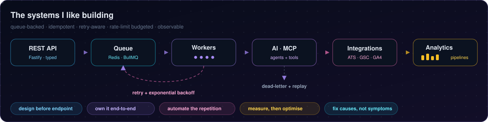
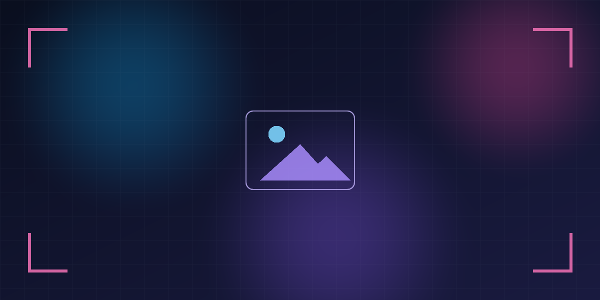
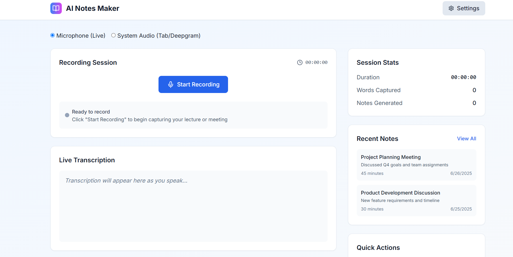
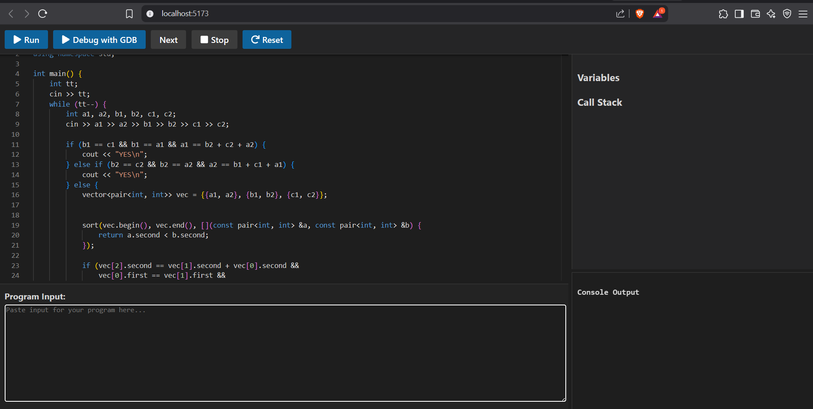

  
  
  

---

## 🚀 About Me

- 💼 **SDE Intern @ SnowSEO** — shipping AI-automation, platform integrations and analytics pipelines that run in production
- 🎓 **Information Technology** student at [Guru Gobind Singh Indraprastha University (GGSIPU)](http://www.ipu.ac.in/)
- ⚔️ **Knight on LeetCode**, and an active competitive programmer on Codeforces &amp; CodeChef
- 🏆 **1x Hackathon Winner** — Smart Delhi Ideathon
- 🧠 Working depth in **distributed job processing, AI automation, MCP servers, REST API design, platform integrations and analytics pipelines**
- 🤖 I **automate anything repetitive** — if a task shows up twice by hand, the third time it's a script, a queue worker or an MCP tool
- 🚀 Open to **internship / full-time opportunities** — [**View My Resume**](https://drive.google.com/file/d/1cudQzuAQi7d6S3ldLEuKeWP6hN_Iwmar/view?usp=sharing)

## 🧭 What I Bring Beyond the Code

> **I take ownership, not tickets.** Hand me a vague problem and I come back with the scope defined, the trade-offs picked and something shipped — not a list of questions.

- 🏗️ **I design the system before I write the endpoint.** Queue topology, idempotency keys, retry and backoff, rate-limit budgets, failure modes — decided and written down first, then built.
- 🔍 **I debug production, not just localhost.** Reading logs and traces, reproducing race conditions, and fixing the cause instead of patching the symptom.
- 🧩 **I move fast inside code I didn't write.** Landing in a large unfamiliar repo and shipping a correct, in-style change is a skill I practise on purpose.
- ♟️ **Competitive programming rewired how I think.** Constraints first, correctness second, cleverness last — plus an instinct for the input that breaks your code.
- 📈 **I close the loop with data.** Shipping isn't done. I instrument it, watch what it actually does in production, and let the numbers pick the next change.
- 📝 **I write the reasoning down.** Design notes and "why not the other way", so the next person — or the next me — doesn't re-litigate a solved decision.

## 🧰 Tech Stack

**Languages**

**Frontend**

**Backend, Queues &amp; Databases**

**Tools &amp; Platforms**

## 💡 Featured Projects

### 🛫 JobPilot — AI Job-Search Agent

<!--
  📸 SCREENSHOT GOES HERE.
  Replace the file  assets/jobpilot.png  with your own screenshot — keep the same
  filename and nothing else needs to change. A ~2:1 image (e.g. 1600x800) fits best.
  The current file is a placeholder I generated.
-->

Set your preferences once and JobPilot keeps doing the repetitive discovery work for you. A **Fastify** API enqueues each search run into **Redis + BullMQ**; background **workers** discover roles across ATS sources (Greenhouse, Lever, Ashby), strip dead links and listicles, check role and experience fit, then AI-vet every opportunity before it reaches your dashboard. Bring-your-own model key, so you choose the provider.

**Why it's interesting:** it's an agent-style background pipeline, not a static job board — queued runs, live progress tracking, and quality filtering that happens *before* you ever see a listing.

 

<table>
<tr>
<td width="50%" valign="top">

### 🎧 AI Lecture Notes Generator

Real-time web app that records lectures, converts speech to text and uses an LLM to generate concise, context-aware notes — filtering out irrelevant chatter. A Node.js pipeline streams audio to a transcription API, then feeds the text to a model for intelligent summarisation.

</td>
<td width="50%" valign="top">

### 🧩 Interactive C++ Code Visualizer

Educational tool that teaches C++ by visualising execution — step-by-step dry runs, live variable state and a dynamic function call stack. A React + D3.js front end renders recursion and function lifecycles interactively, making hard concepts click.

</td>
</tr>
</table>

### 🤖 Personalized Jarvis Assistant

Python voice assistant built with SpeechRecognition, pyttsx3, FastAPI and spaCy/NLTK that executes natural-language commands. Modular, extensible architecture with system control, web automation, task scheduling and plug-in commands.

&nbsp;

<b>🗂️ More things I've built</b>

 

## 📊 GitHub Analytics

<!--
  Cards are served by github-profile-summary-cards and streak-stats, both of which
  render reliably. Deliberately NOT used here: github-readme-stats.vercel.app,
  github-readme-activity-graph.vercel.app and github-profile-trophy.vercel.app —
  each of those shared public instances is rate-limited hard enough that the images
  regularly fail to load. If you want those cards back, self-host them first:
  https://github.com/anuraghazra/github-readme-stats#deploy-on-your-own-vercel-instance
-->

<picture>
  <source srcset="https://github-profile-summary-cards.vercel.app/api/cards/profile-details?username=DebasisCode&theme=github_dark" media="(prefers-color-scheme: dark)" />
  
</picture>

<picture>
  <source srcset="https://github-profile-summary-cards.vercel.app/api/cards/repos-per-language?username=DebasisCode&theme=github_dark" media="(prefers-color-scheme: dark)" />
  
</picture>
<picture>
  <source srcset="https://github-profile-summary-cards.vercel.app/api/cards/most-commit-language?username=DebasisCode&theme=github_dark" media="(prefers-color-scheme: dark)" />
  
</picture>

<picture>
  <source srcset="https://github-profile-summary-cards.vercel.app/api/cards/stats?username=DebasisCode&theme=github_dark" media="(prefers-color-scheme: dark)" />
  
</picture>
<picture>
  <source srcset="https://streak-stats.demolab.com?user=DebasisCode&hide_border=true&theme=tokyonight" media="(prefers-color-scheme: dark)" />
  
</picture>

## ⚔️ Competitive Programming

  

**Codeforces — live from the Codeforces API**

  

**LeetCode**

<picture>
  <source srcset="https://leetcard.jacoblin.cool/Debasis6969?theme=dark&font=Inter&ext=heatmap" media="(prefers-color-scheme: dark)" />
  
</picture>

## 🌐 Connect With Me

---

  ✨ Thanks for visiting my profile — let's build something amazing together.

